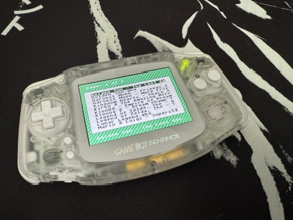

# EDGBA PRO — Nintendo DS theme

A menu theme for the EverDrive GBA PRO inspired by the Nintendo DS's
"Favorite Color" palette.

## Install

1. Download the [latest release](https://github.com/rlcodi/edgba-pro-ds-theme/releases/latest).
2. Copy the `.bgr` files to `/edgba/themes/` on the SD card.
3. Boot the cart, open the Themes folder, highlight a theme, then select and
   set theme.
