# EDGBA PRO — Nintendo DS theme

A menu theme for the EverDrive GBA PRO, done up in all 16 colors straight
off the Nintendo DS's own "Favorite Color" screen — same palette, shown below.

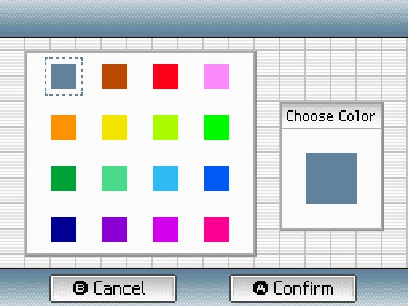

## Install

1. Download the [latest release](https://github.com/rlcodi/edgba-pro-ds-theme/releases/latest).
2. Copy the `.bgr` files to `/edgba/themes/` on the SD card.
3. Boot the cart, open the Themes folder, highlight a theme, then select and
   set theme.

## Variant Screenshots

<table>
<tr>
<td align="center"><code>dsgrey.bgr</code> 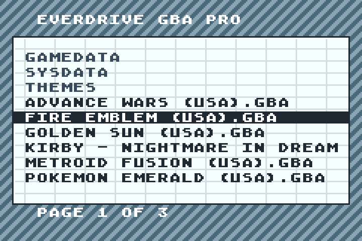</td>
<td align="center"><code>dsbrown.bgr</code> 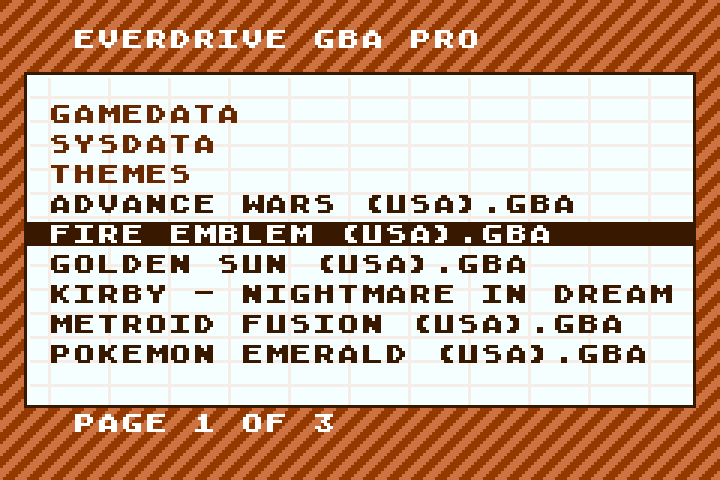</td>
<td align="center"><code>dsred.bgr</code> 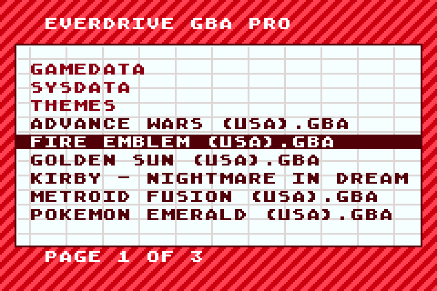</td>
</tr>
<tr>
<td align="center"><code>dspink.bgr</code> 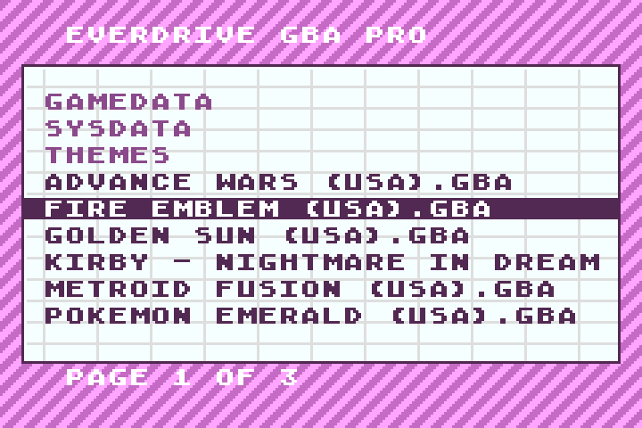</td>
<td align="center"><code>dsorange.bgr</code> 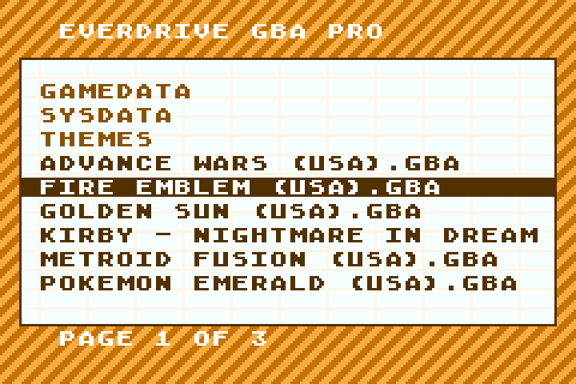</td>
<td align="center"><code>dsyellow.bgr</code> 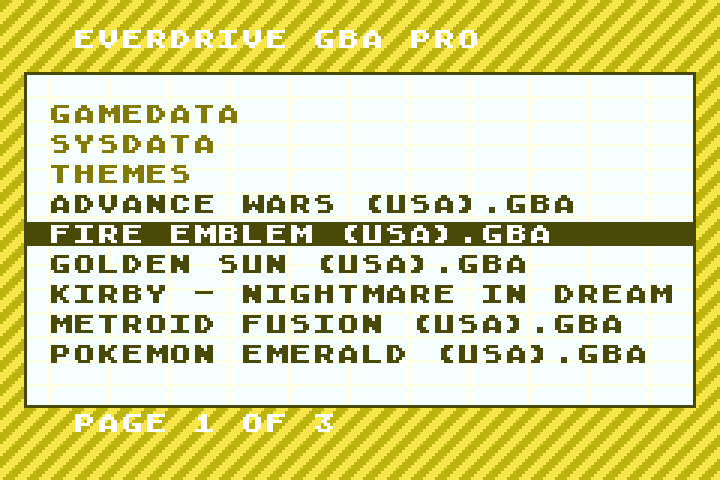</td>
</tr>
<tr>
<td align="center"><code>dslime.bgr</code> 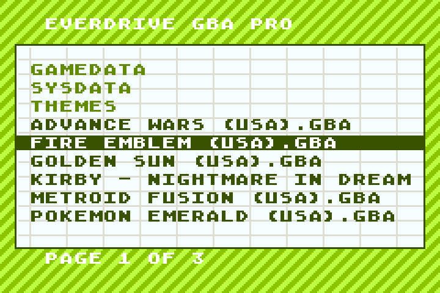</td>
<td align="center"><code>dsgreen.bgr</code> </td>
<td align="center"><code>dsdarkgreen.bgr</code> 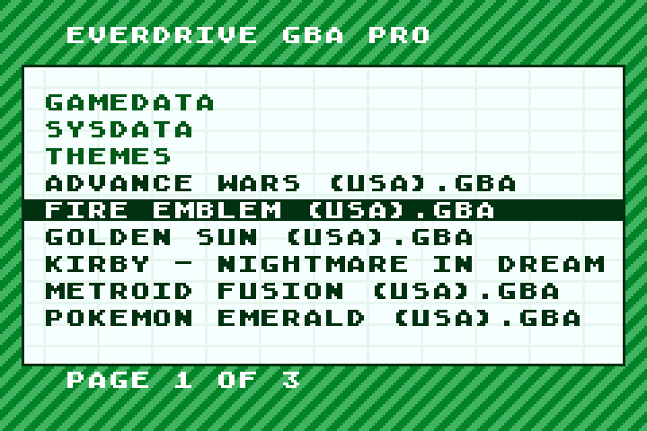</td>
</tr>
<tr>
<td align="center"><code>dsmint.bgr</code> 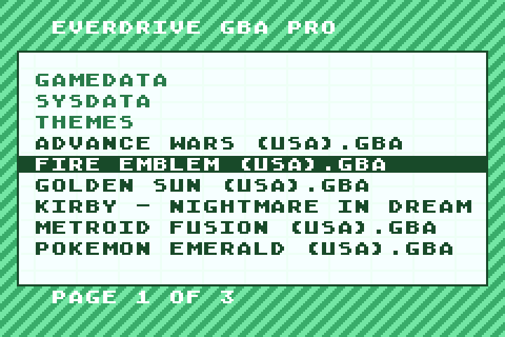</td>
<td align="center"><code>dsskyblue.bgr</code> 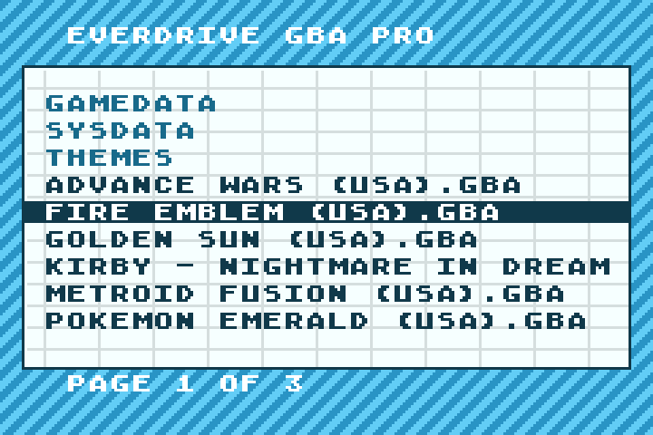</td>
<td align="center"><code>dsblue.bgr</code> 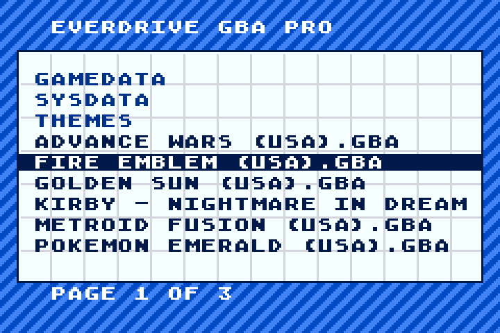</td>
</tr>
<tr>
<td align="center"><code>dsnavy.bgr</code> 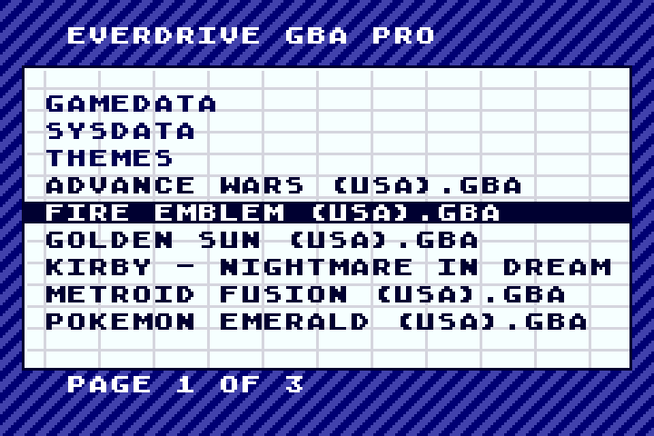</td>
<td align="center"><code>dspurple.bgr</code> 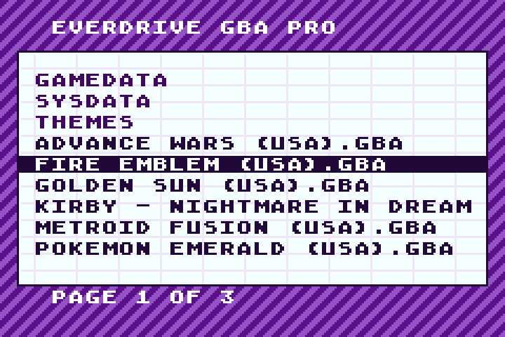</td>
<td align="center"><code>dsmagenta.bgr</code> 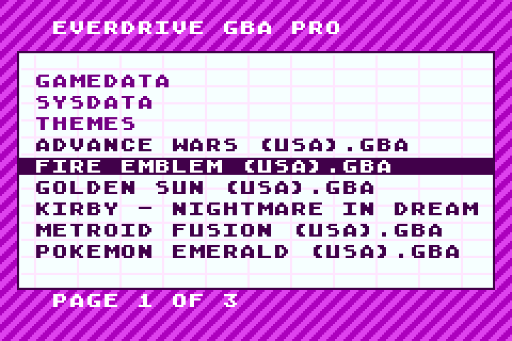</td>
</tr>
<tr>
<td align="center"><code>dscrimson.bgr</code> </td>
</tr>
</table>
